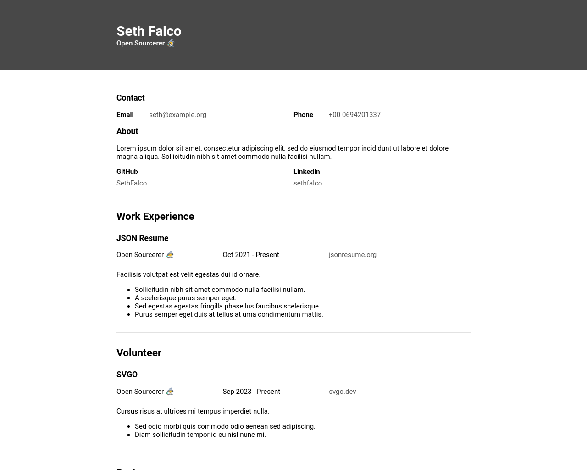
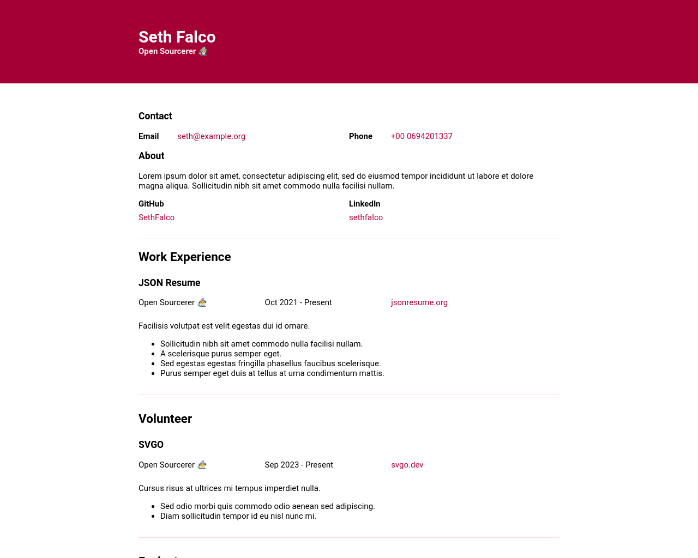
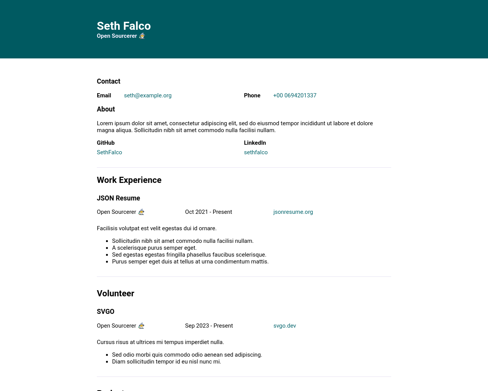
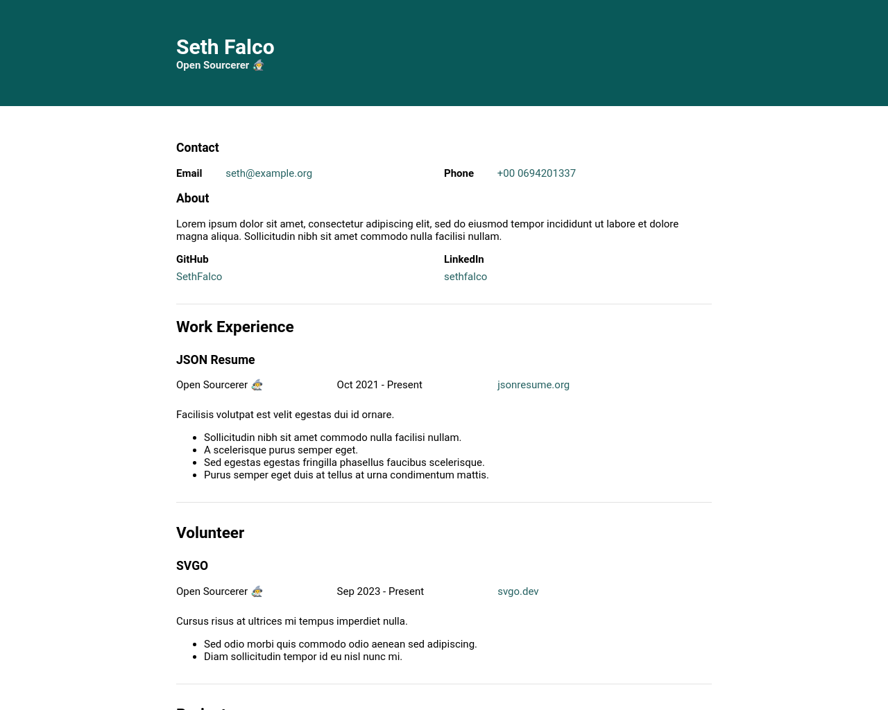
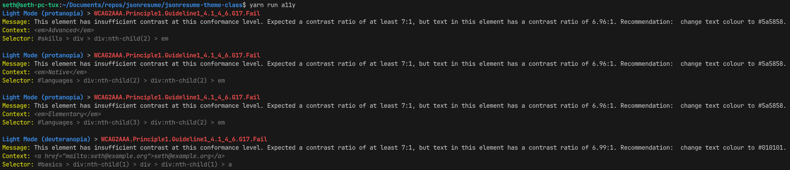

# Extensive Color Limited Vision Testing

I've attempted to define a more extensive series of automated tests for color limited (color blindness) accessibility testing.

This ultimately just describes what's happening in the [`pa11y.js`](./pa11y.js) file in this branch. I've included some JSDocs in there too!

There are also services offering a similar thing, but they typically crawl a live website. I'd prefer to explore things easy to use during development and based on Open Source tooling.

Anyway… we'll need some dependencies here! 😅

| Dependency | Purpose |
|---|---|
| `pa11y` | A popular Open Source tool for doing some automated accessibility checks, including poor color contrast. |
| `css-tree` | To parse the `<style>` tag and override colors between tests. |
| `color-convert` | To convert colors from hex to RGB. |
| `@cantoo/color-blindness` or `@bjornlu/colorblind` | Libraries for simulating a color deficiency. |

All of these dependencies are very popular except for the color deficiency simulation ones. Unfortunately, this is a pretty niche use case, so there was no obvious pick. I short listed these two based on the author rather than the usage stats, and then tried both.

* `@cantoo/color-blindness`: Written by Cantoo, a seemingly reputable organization in France, it even has some public funding. 
* `@bjornlu/colorblind`: Written by Bjorn Lu, a core maintainer of Vite.

However, neither produce identical results to the simulation modes offered by Chromium or Firefox.

| | Chromium | `@cantoo/color-blindness` | `@bjornlu/colorblind` |
|---|---|---|---|
| normal |  |  |  |
| achromatopsia |  |  |  |
| deuteranopia |  |  |  |
| protanopia |  |  |  |
| tritanopia |  |  |  |

Overall, `@cantoo/color-blindness` seems better as it matches Chromium's simulations fairly well on 4 out of 5 of them. I'm not sure why they struggle with deuteranopia. I haven't taken the time to go through the math, and doubt I'd be intelligent enough to understand it anyway.

## Flow

1. Build page.
2. Read page with Puppeteer, and save `<style>` to variable.
3. Parse styles, and transform them with a deficiency simulation library.
4. Read page with Puppeteer again, override `<style>` tag, and save to tmp directory.
5. Run pa11y tests over the new file from tmp.

This could definitely be done more efficiently, but it was just a [PoC](https://wikipedia.org/wiki/Proof_of_concept).

## Caveats

* Only modifies hex colors. (i.e. `#000000` or `#fff`)
* Only changes colors found in the pages first `<style>` tag.
* Algorithms used by imported libaries aren't the same as browser simulations.
* Does not modify browser default styles.
* Does not modify images.

This is nothing but a quick and dirty proof-of-concept showing a couple of things one could explore if they wanted to take it further.

## How to Test

Either run `yarn run build:html`, or just plop a file called `resume.html` in the working directory.

Then run `yarn run a11y`—all this does it run the `pa11y.js` script. You can inspect it, which has 100% of the code this report is based on.

Before adding the color deficiency simulations, I passed all tests. But with the new setup, there are some failures, though by a very small margin. This isn't a particularly complex webpage.

## Does this suck?

If using Pa11y to actually run through the automated checks doesn't suit you for one reason or another, there are a few other takeaways from this.

### Puppeteer

You could use Puppeteer to automate the screenshots.

I don't use it in this script, but Puppeteer does have the [`Page#emulateVisionDeficiency`](https://pptr.dev/api/puppeteer.page.emulatevisiondeficiency) function. This could be used to at least generate the screenshots automatically, then you can do what you want with it manually.

I don't use `emulateVisionDeficiency` as it only changes the UI, but not the underlying color values. Tooling like Pa11y will still only see original hex values which were present before, which is why the only way to really test it is by replacing the hex colors before.

### `@cantoo/color-blindness`

You could integrate `@cantoo/color-blindness` with another tool tool, for example:

* With PostCSS, to create alternative builds with modified hex values, then you can continue in Firefox as normal.
* Or as a code editor plugin, like to show the effective hex color with different color deficiencies on hover.

If something jumps out to you, feel free to shout, and I can make a note of it as a potential project in future. 🤞

## Disclaimer

Obligatory, this in no way suggests that one should solely rely on automated tools for accessibility testing, nor that they should be used as a bible.

If one has the capacity or knowledge, it's generally better to manually test with individuals with lived experience with the conditions. However, CI is still better than nothing, and a cheap solution when one doesn't have testers on-hand.
